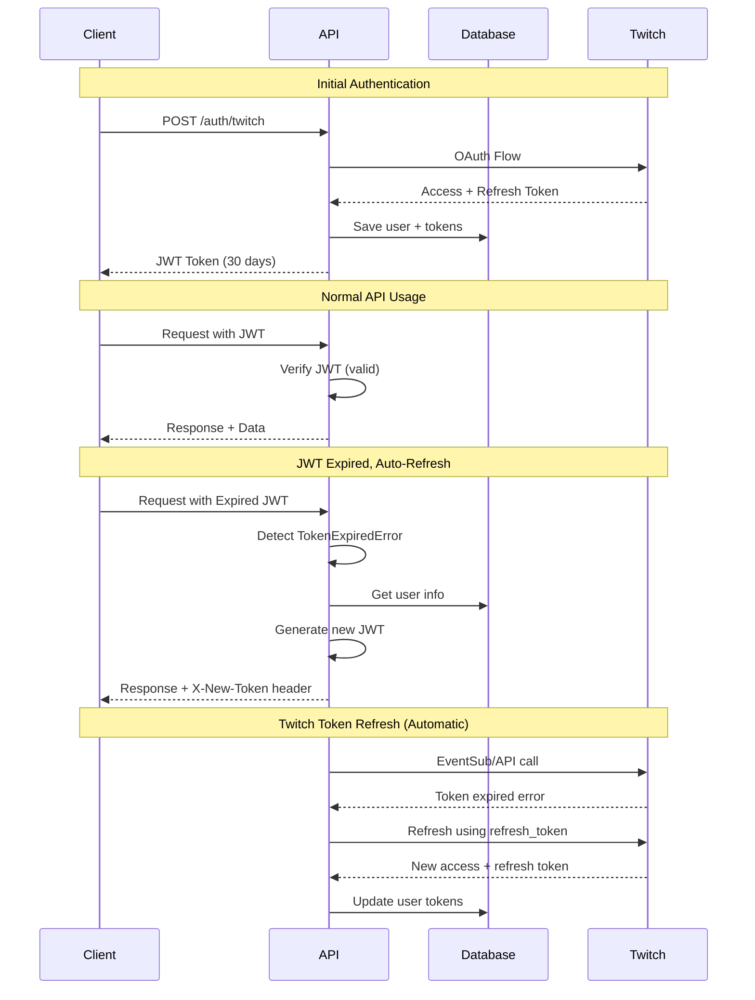

# JWT Token Refresh Implementation

## Overview

The OmniAsylum Stream Counter now implements **automatic JWT token refresh** to provide a seamless user experience without requiring re-authentication when tokens expire.

## How It Works

### 1. **Automatic Refresh in Middleware**

When a request is made with an **expired JWT token**, the authentication middleware (`authMiddleware.js`) automatically:

1. **Detects** the `TokenExpiredError`
2. **Decodes** the expired token to get user info (without verification)
3. **Validates** the user still exists and is active
4. **Generates** a new 30-day JWT token
5. **Returns** the new token in response headers:
   - `X-New-Token`: The new JWT token
   - `X-Token-Refreshed`: `true` (indicates refresh occurred)
6. **Continues** processing the request normally

### 2. **Manual Refresh Endpoint**

For proactive token refresh, use:
```
POST /auth/refresh-jwt
Authorization: Bearer <expired_or_valid_jwt>
```

**Response:**
```json
{
  "token": "new_jwt_token_here",
  "user": {
    "userId": "125828897",
    "username": "riress",
    "displayName": "Riress",
    "role": "admin"
  },
  "expiresIn": "30d"
}
```

## Frontend Integration

### JavaScript/Fetch API

```javascript
class TokenManager {
  constructor() {
    this.token = localStorage.getItem('authToken');
  }

  async makeAuthenticatedRequest(url, options = {}) {
    // Add auth header
    const headers = {
      ...options.headers,
      'Authorization': `Bearer ${this.token}`
    };

    const response = await fetch(url, { ...options, headers });

    // Check for automatic token refresh
    if (response.headers.get('X-Token-Refreshed') === 'true') {
      const newToken = response.headers.get('X-New-Token');
      if (newToken) {
        console.log('🔄 Token automatically refreshed');
        this.token = newToken;
        localStorage.setItem('authToken', newToken);
      }
    }

    // Handle expired tokens that couldn't be refreshed
    if (response.status === 401) {
      const data = await response.json();
      if (data.requireReauth) {
        // Redirect to re-authentication
        window.location.href = data.authUrl;
        return;
      }
    }

    return response;
  }

  async refreshToken() {
    try {
      const response = await fetch('/auth/refresh-jwt', {
        method: 'POST',
        headers: {
          'Authorization': `Bearer ${this.token}`
        }
      });

      if (response.ok) {
        const data = await response.json();
        this.token = data.token;
        localStorage.setItem('authToken', data.token);
        console.log('✅ Token manually refreshed');
        return true;
      }
    } catch (error) {
      console.error('❌ Failed to refresh token:', error);
    }
    return false;
  }
}

// Usage example
const tokenManager = new TokenManager();

// All API calls will automatically handle token refresh
const response = await tokenManager.makeAuthenticatedRequest('/api/stream/status');
```

### Axios Interceptor

```javascript
// Response interceptor to handle automatic token refresh
axios.interceptors.response.use(
  (response) => {
    // Check for automatic token refresh
    if (response.headers['x-token-refreshed'] === 'true') {
      const newToken = response.headers['x-new-token'];
      if (newToken) {
        console.log('🔄 Token automatically refreshed');
        localStorage.setItem('authToken', newToken);

        // Update default header for future requests
        axios.defaults.headers.common['Authorization'] = `Bearer ${newToken}`;
      }
    }
    return response;
  },
  (error) => {
    if (error.response?.status === 401) {
      const data = error.response.data;
      if (data.requireReauth) {
        // Redirect to re-authentication
        window.location.href = data.authUrl;
      }
    }
    return Promise.reject(error);
  }
);
```

## Token Lifecycle



## Benefits

1. **Seamless UX**: Users never see "token expired" errors
2. **Security**: Tokens still expire regularly (30 days)
3. **Automatic**: No frontend changes required for basic functionality
4. **Flexible**: Manual refresh endpoint for proactive management
5. **Graceful Degradation**: Clear re-auth flow when refresh fails

## Security Considerations

- **JWT tokens** expire every 30 days
- **Automatic refresh** only works if user account is still active
- **Re-authentication required** if Twitch tokens are too old (>60 days)
- **HTTPS only** for all token transmission
- **No token blacklisting yet** - consider implementing for logout

## Testing

```bash
# Test with expired token
curl -H "Authorization: Bearer expired_jwt_token" \
     -H "X-Debug: true" \
     https://stream-tool.cerillia.com/api/stream/status

# Should return new token in X-New-Token header
```

## Migration Notes

- **Existing tokens** will be automatically refreshed on first use
- **No breaking changes** to existing API endpoints
- **Optional headers** - clients can ignore refresh headers if desired
- **Backward compatible** with manual token refresh patterns
